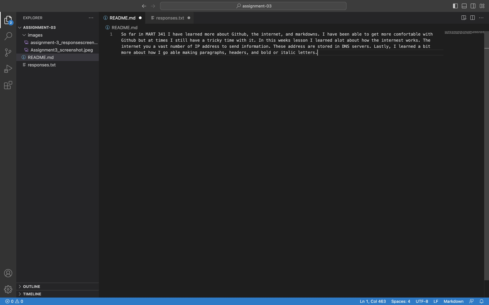
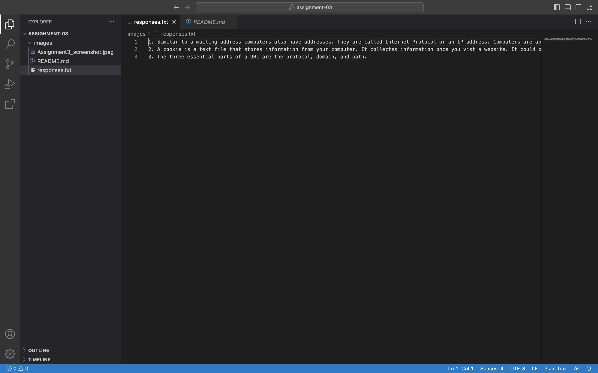

#README
So far in MART 341 I have learned more about Github, the internet, and markdowns. I have been able to get more comfortable with Github but at times I still have a tricky time with it. In this weeks lesson I learned alot about how the internest works. The internet you a vast number of IP address to send information. These address are stored in DNS servers. Lastly, I learned a bit more about how I go able making paragraphs, headers, and bold or italic letters.

[My File](/responses.txt)

