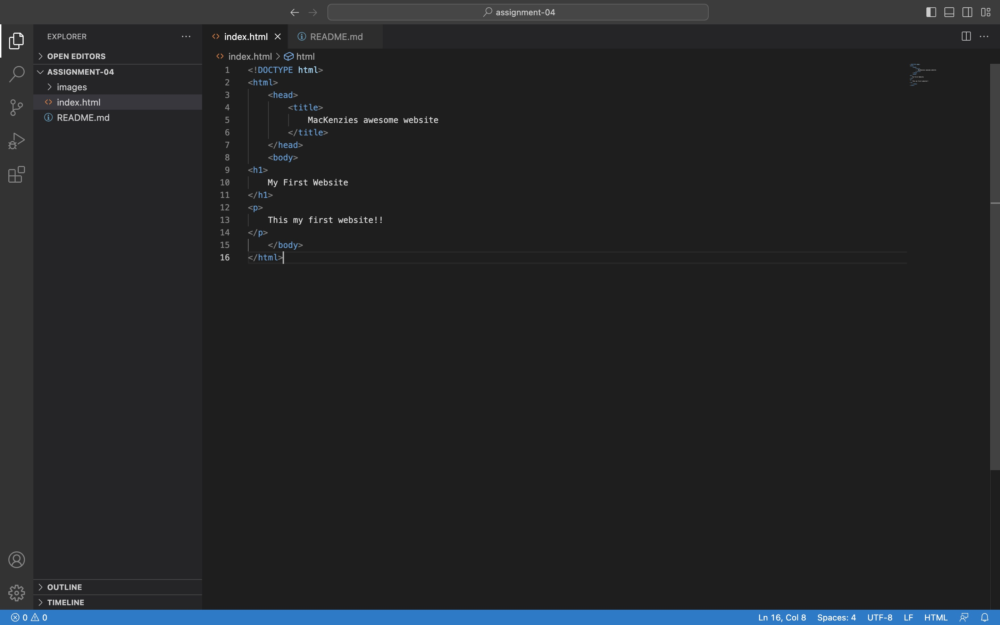
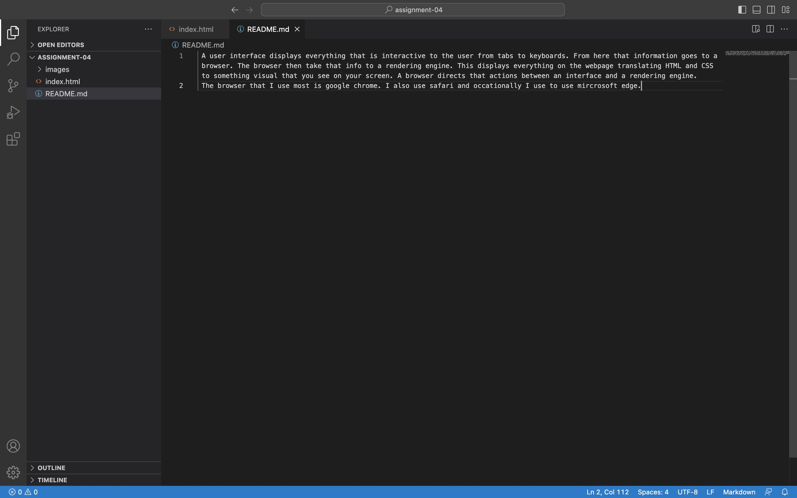

 A user interface displays everything that is interactive to the user from tabs to keyboards. From here that information goes to a browser. The browser then take that info to a rendering engine. This displays everything on the webpage translating HTML and CSS to something visual that you see on your screen. A browser directs that actions between an interface and a rendering engine.
 The browser that I use most is google chrome. I also use safari and occationally I use to use mircrosoft edge.

 
 
 