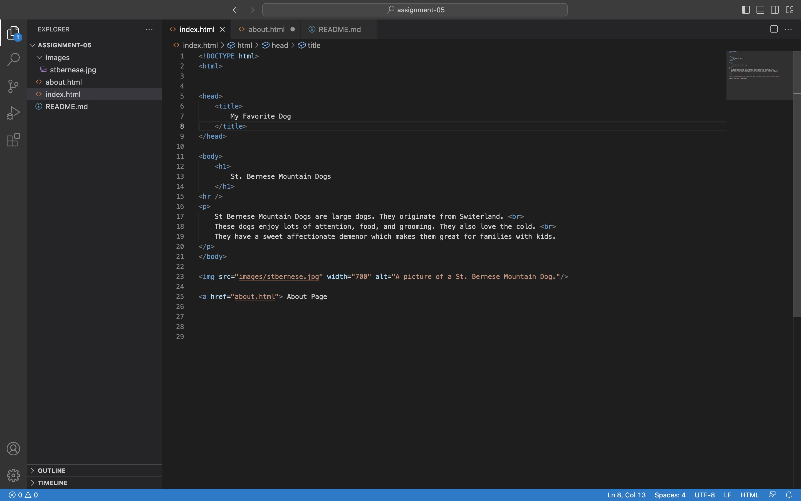
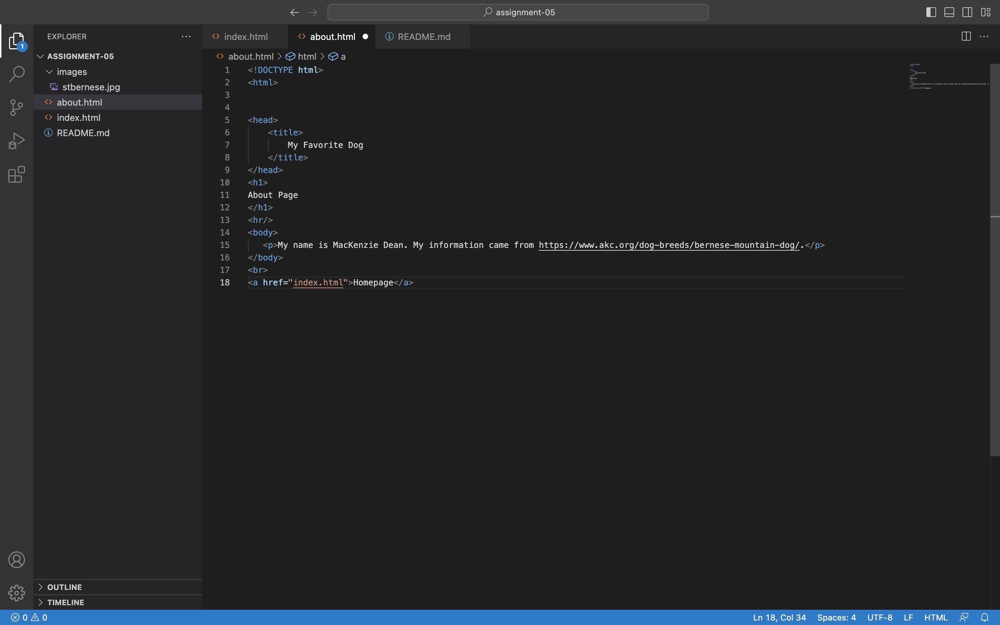

I choose to look at an amazon website from 2008. The design is more simple than it is today. Most of the page is white. It has a search bar, email, password bar, and a couple ther small icons. For the most part the rest of the webpage is blank. It is not colorful like it is today. There are no other tabs or picture. Everything is straight and to the point.

