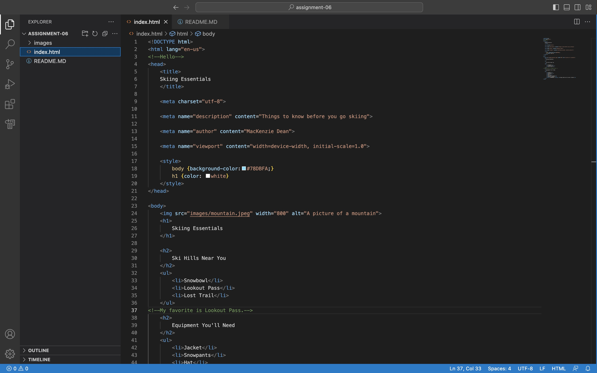
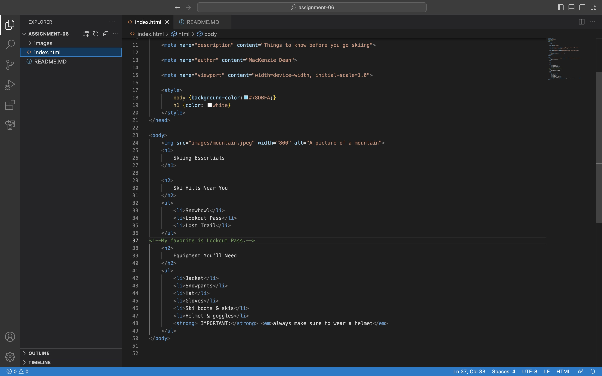

A structual markup gives the structure to a document. It includes headings, paragraphs, breaks, and lists. This gives information on the document. Semantic markups are all the little things that goes into information you're reading on the document. This includes emphasis (italics), strong words (words that are bolded), or citations (quotations). They reinforce the info on the document.

