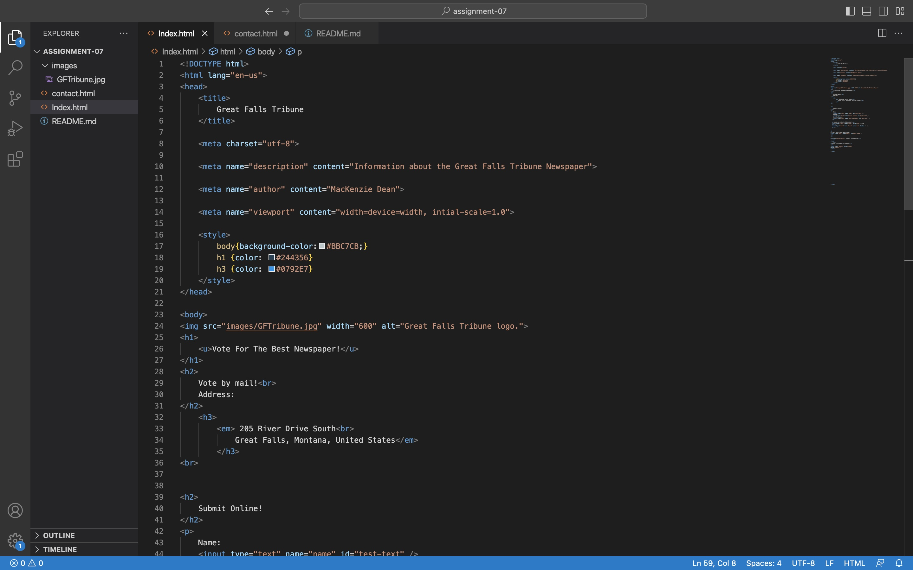
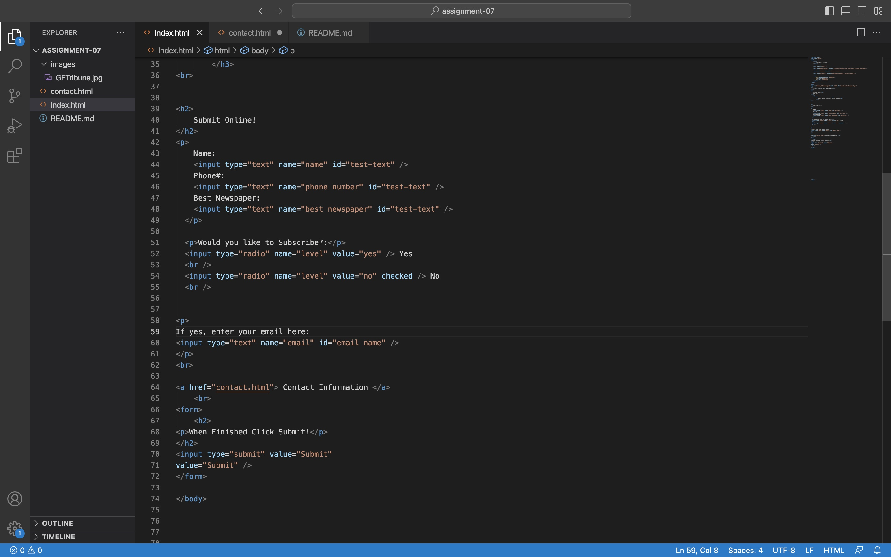
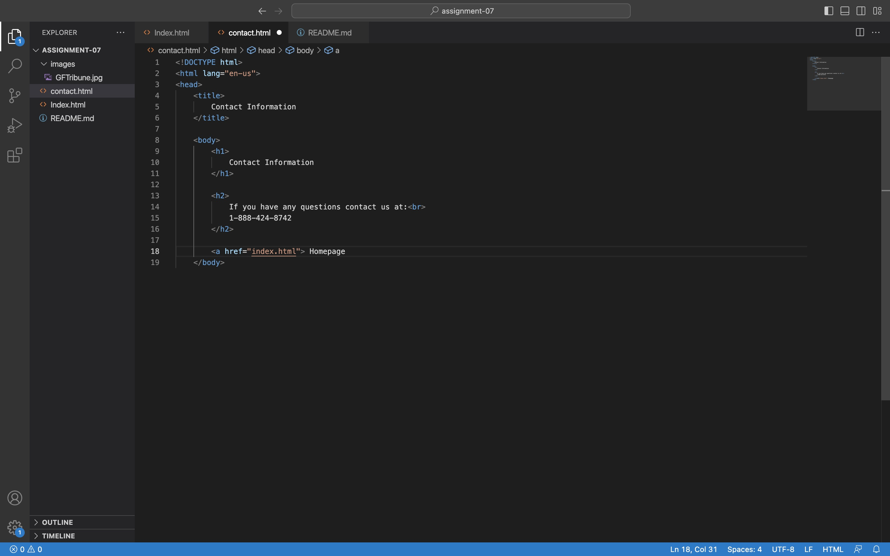

The most common form I come across browsing the web is asking if I'm a robot or not. It will pop up on my screen, ask me to select certain pictures, then I click submit. This form is to ensure i'm not a robot or a virus trying to disrupt the website I'm on.
Another one I get will ask me if I want to allow cookies. Cookies stores information while I'm going on a website. Some people may or may not want informaion collecting as they are browsing.

