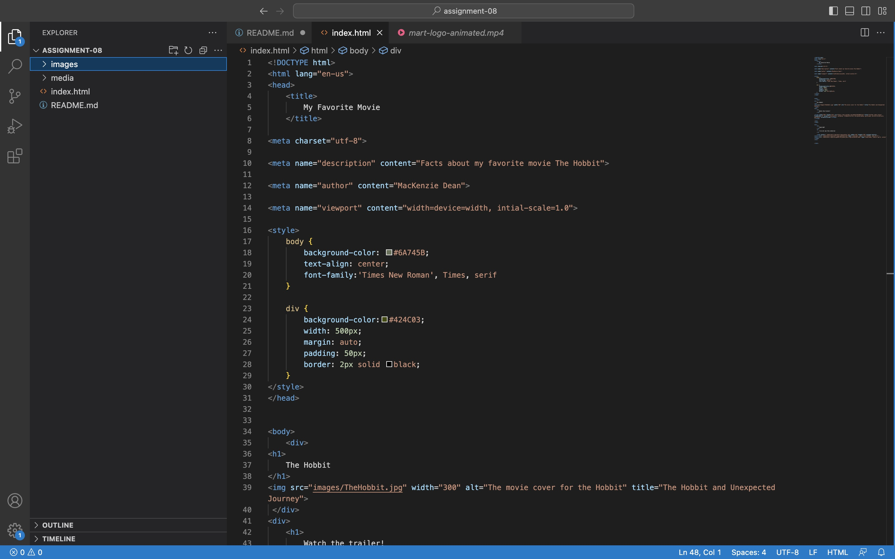
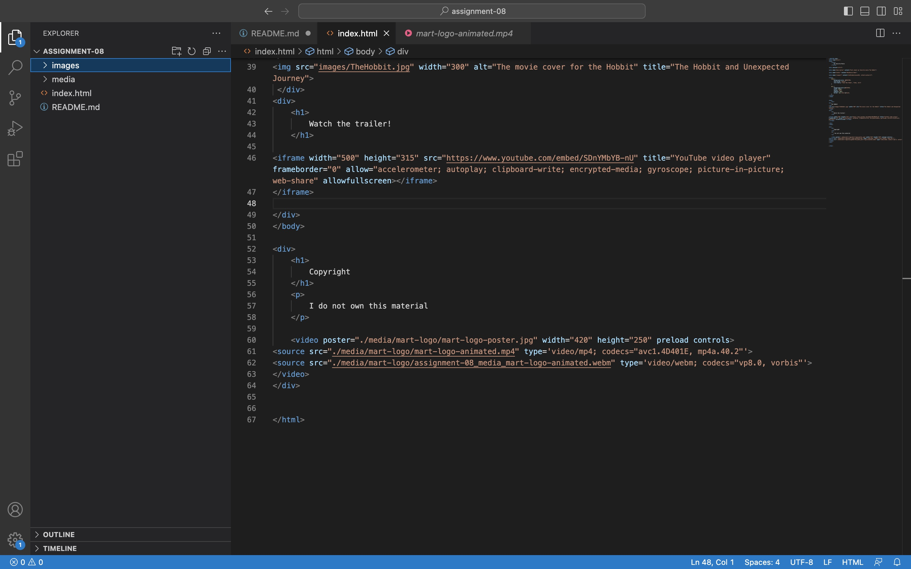

1. Affordance is the realtionship between the action of a user on an object. It can suggest how an object should be used.

2. Using a third-party service like Youtube is a great way to enhance your website. Sometimes you need external sights to relay more information than you can provide. By hosting one or your videos on a differnt site it can increase the exposure to your website. However since your video is on another site that means you have less control. Other people might want to link your video to there sights too. Additional if Youtube decides to redesign there sight you have no control over how they will go about that. This could potentially change how an audience views your content.

3. At first I could not get my Youtube video to center. I adjusted the darker green color thinking that would do the trick. I ended up changing the width of the video from the code I copied from Youtube.

