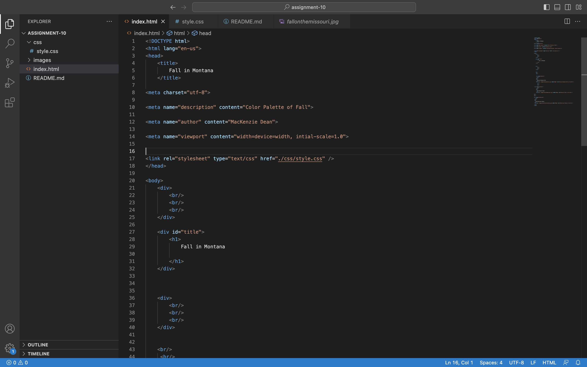
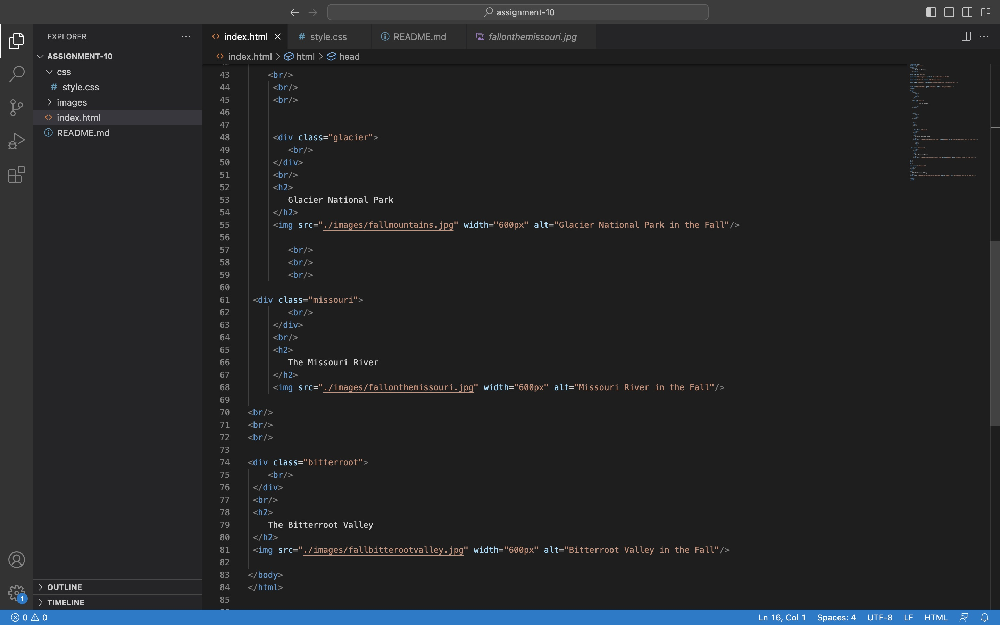
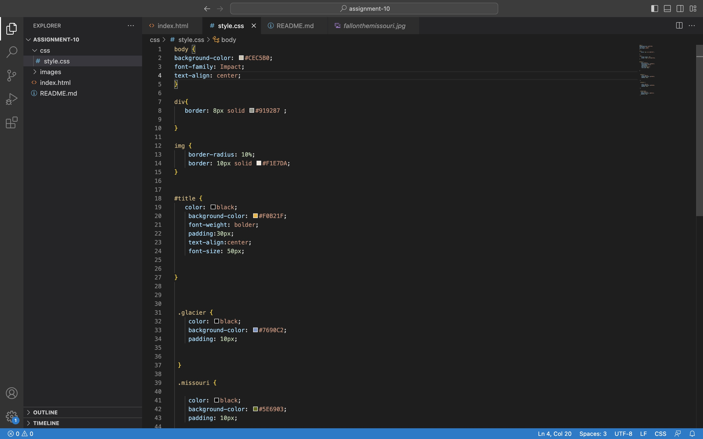
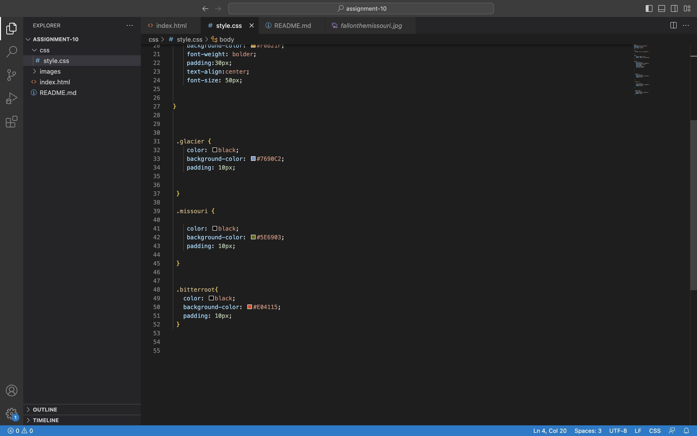

A universal selector is used to style every element on a page.
A element selctor is similar to a universal selector however it selects element of a certain kind instead of all elements. 
A class selector can be used to name and assign html elements. You can use a class selector to select elements that serve the same function. These start with a (.) 
Id selectors allows you to define style rules for a certain element. You start it with a (#). Id selectors apply to one element in a page while class selectors can apply to several.

Some of my favorite colors come from fall. When I started creating the website I first found the images. The colors were inspired from the images. I chose a neutral biege color as the background. I didnt want the main background color to be too distracting  Next I chose colors that I found within the images. I put blue in there to complement the mountains and to also break up the tones a bit. The other colors like the green and red, I found small hints of them within the images. All the bright colors happen to be primary colors as well.

When I was working on this project I tried to have the words inside of a box similar to the title. For some reason I could not get get a box around my other titles. Otherwise everything went well and I'm getting better at solving problems within the code.

