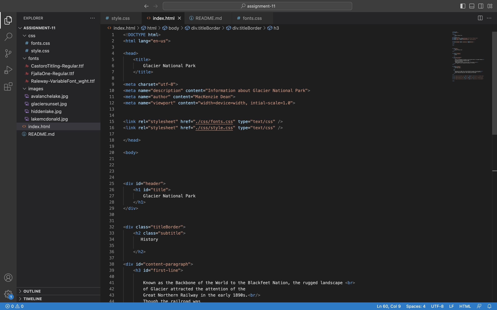
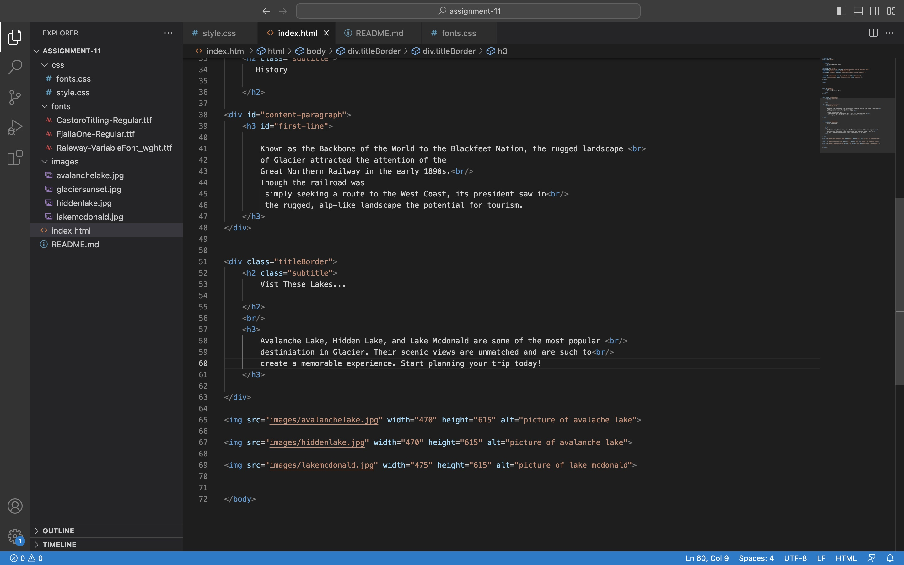
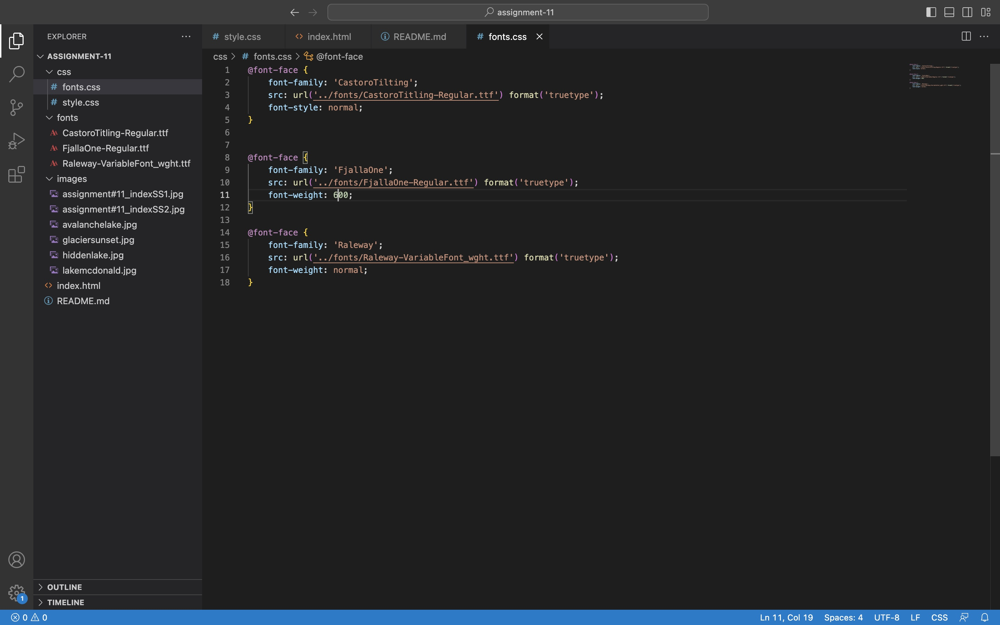
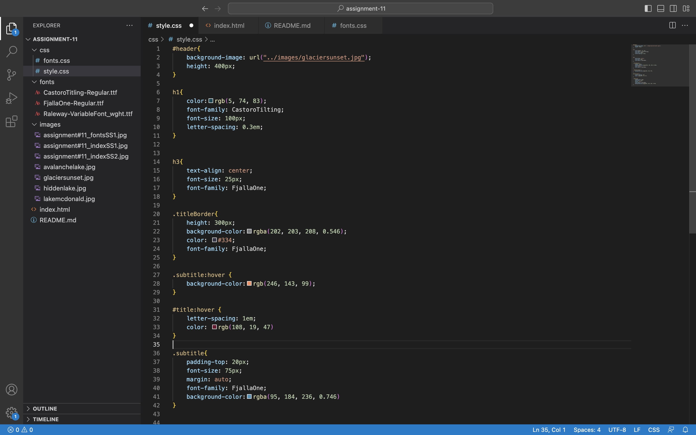

Typography is the art of how you display print. This is how most information is presented, using letters. The shape and font of a word can make a big difference visually is a display.

A font stack is a list of fonts that you would like to use. The first font in the stack is your primary font. If for some reason that font isn't working you go to the next font in the list also known as a a fallback font. These font are important to plan correctly because it will affect the page layout. Its also good to have a backup plan if a font wont work with your system.

A system font is already installed in a users device but not always allowed on the interent becasue of licensing. Since these are not always allowed that often have to be exported as images.

A web font is not already installed in a users device. They are custom fonts a require certain elements to get called up correctly and are not on most devices by default. 

Web-safe fonts are already available in a system whether its a Windows or a Mac. This give you the best opportunity of having your text appear how you chose it.

