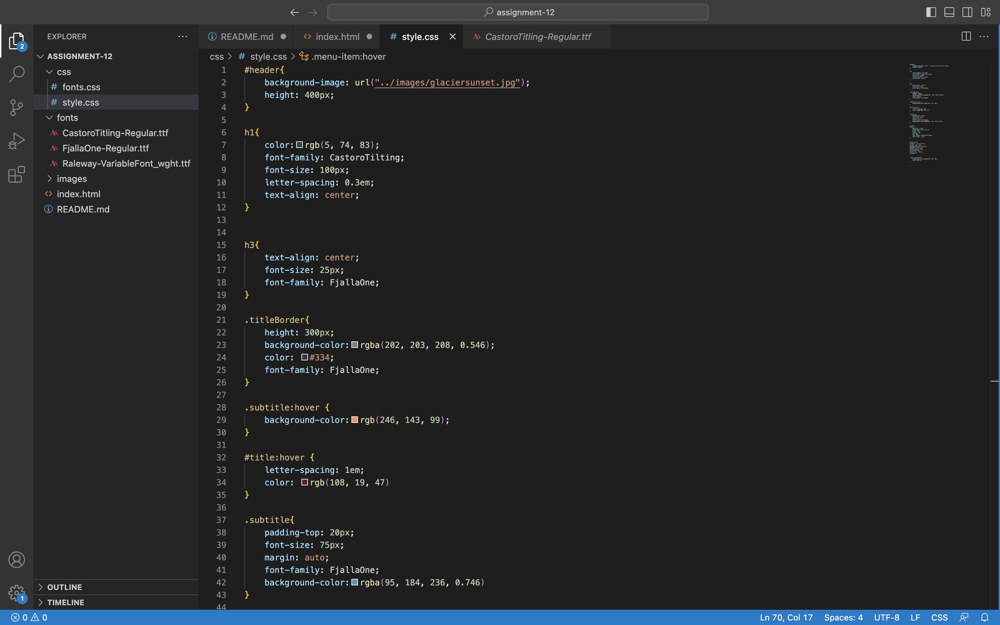

Padding goes on the outside your content whether this be an image or text. Padding is the space between content and border of the box. Once you have this then a border goes around your padding. A margin is the outer most layer the surrounds the entirety of the box.

For the most part everything went very smooth with this assignment. The only issue I had a first was with the drop down menu. My title, Glacier National Park, was covering most of my content. I then added   inbetween my title and the rest of my content. Then my drop down menu worked correctly.

